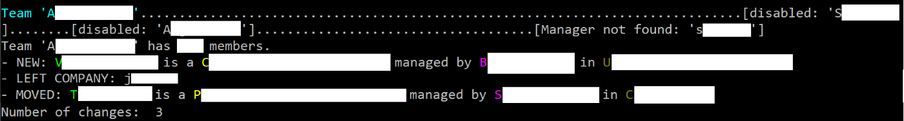

# ColleagueTracker

This is a simple Windows Command-Line tool, written in C# and developed in Visual Studio 2017, that checks the Active Directoy for changes in structure. The goal is to quickly find out about people leaving, joining, or changing place in the hierarchy.

The tool is configured with a set of teams (for example, departments or units in the company), and for each team, the logins of the respective managers. When executed for the first time, it fetches the list of direct reports and stores it in a set of json files. The next time it executes, it again reads the structure, compares with the already existing json files, and displays the deltas.

## Configuration - App.Config

To configure the application you have to edit App.Config:

```xml
<ColleagueTracker LdapPath="LDAP://DC=department,DC=company,DC=com">
    <Teams >
      <Team name="Team1" managers="manager1,manager2,manager3"/>
      <Team name="Team2" managers="manager4,manager5,manager6"/>
    </Teams>
</ColleagueTracker>
```

There Team1/Team2 are the names of the departments/units, and managerN are the logins of the managers in that team. The LdapPath depends on your specific organization, you'll have to use a tool to find out what it is in your specific case.

## Output

For each team, the application writes out/reads two files: deltas_teamName.json and users_teamName.json . The first file stores a set of simple records: "joined, userid1, 1/1/2017" or "left, userid2, 2/2/2018". The second file simply stores the logins of the current users in the respective team.



